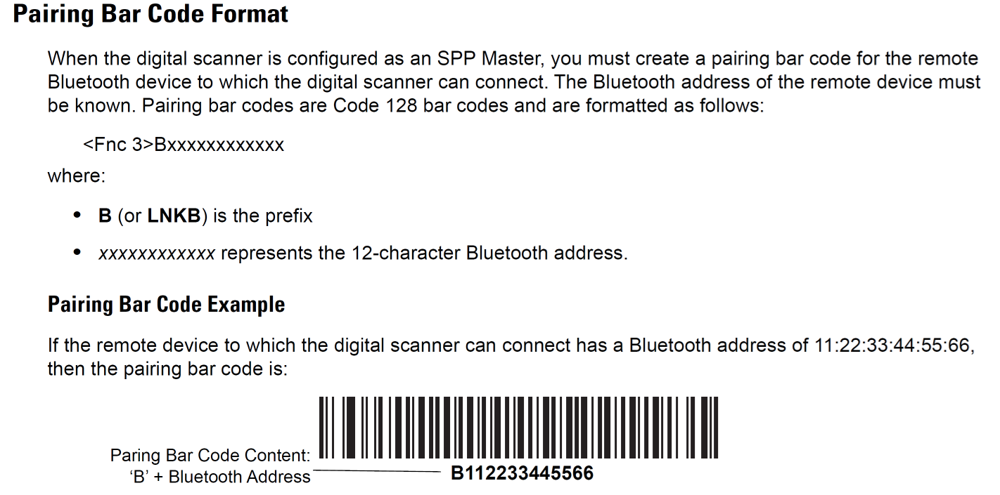

# ZebraスキャナとプリンタをBluetooth接続するバーコードをZPLで作成する方法

スキャナとプリンタ間のペアリングをするためのバーコードをラベルプリンタで出力したいニーズがあります。123Scanでもペアリング用バーコードを作成できますが、下記のようなシーンでは少し不便です。

・ プリンタに添付するペアリング用ラベルを印刷したい 
・ 多数のペアリングラベルを連続で印刷したい 
・ 高品質なペアリングバーコードを印刷したい 

このような場合はラベルプリンタを用いてZPL方式で印刷すると便利かもしれません。

 
 

bluetooth macの確認方法や具体的な手順については下記リンクを参照ください。

[Zebra BlutoothスキャナとZebra プリンタと直接接続する方法](https://github.com/shimauma-giken/Zebra-Scanner-How-to-direct-connect-bluetooth-scanner-to-printer)

 

#### バーコード作成用のZPL

1. "Central Settings" 用のバーコード

    <pre>
    ^XA
    ^LS0
    ^FO75,50
    ^A0N,30,30^FDBluetooth Central^FS
    ^BY2,3,96
    ^FO75,130^BCN,,Y,N
    ^FD>:>2N017F0E^FS
    ^PQ1,0,1,Y^XZ
    </pre>

2. "Bluetooth Paring"用バーコード

    ##### 構文
    <pre>
    ^XA
    ^LS0
    ^BY2,3,96
    ^FO75,130^BCN,,Y,N
    ^FD>:>2B[Bluetooth MAC/Short]^FS
    ^PQ1,0,1,Y^XZ
    </pre>

    ##### 例、Bluetooth macが48A493D404D1の場合
    <pre>
    ^XA
    ^LS0
    ^BY2,3,96
    ^FO75,130^BCN,,Y,N
    ^FD>:>2B48A493D404D1^FS
    ^PQ1,0,1,Y^XZ
    </pre>

#### 参考情報

 

